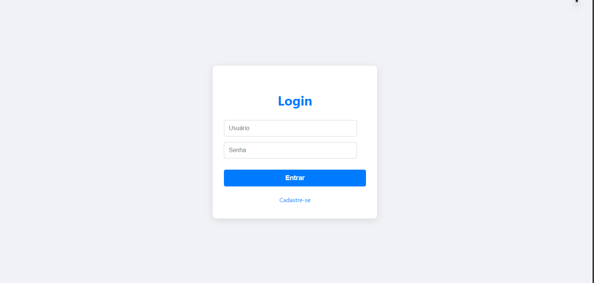
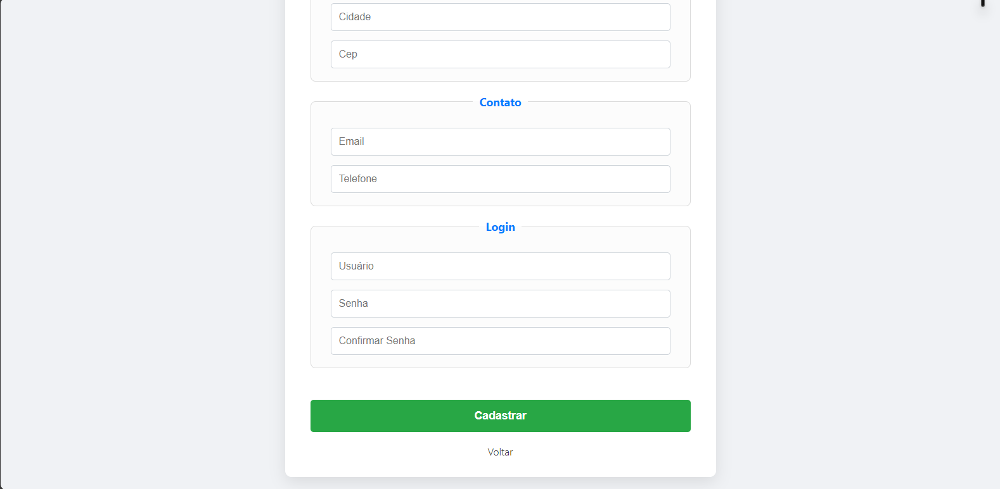

# Relatório do Projeto - Sistema de Login (Parte 1)

## Introdução

Neste projeto de desenvolvimento de sistemas, estou criando um site e, como primeira etapa, implementei a tela de login utilizando HTML e CSS. Essa etapa é fundamental para garantir que os usuários possam acessar o sistema de forma segura e intuitiva.

## Objetivo

Desenvolver a interface do sistema de login com foco em usabilidade, design responsivo e acessibilidade, utilizando apenas HTML e CSS nesta fase inicial.

## Tecnologias Utilizadas

- **HTML5**: Para estruturação da página de login.
- **CSS3**: Para estilização visual da página, garantindo um layout moderno e responsivo.

## Funcionalidades Implementadas

- Formulário de login com campos para:
  - Nome de usuário/email
  - Senha
- Botão de envio do formulário.
- Feedback visual para campos de entrada (foco, hover).
- Design responsivo para diferentes tamanhos de tela.

## Estrutura do Código

- **index.html**: Contém a estrutura do formulário de login.
- **style.css**: Responsável pela estilização do formulário e elementos visuais da página.

## Próximos Passos

- Implementar a validação do formulário usando JavaScript.
- Conectar o formulário a um backend para autenticação real.
- Adicionar recursos de segurança, como criptografia da senha.

## Print da Tela

